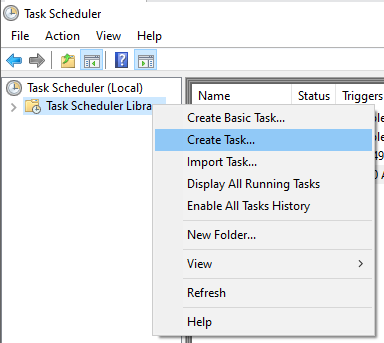
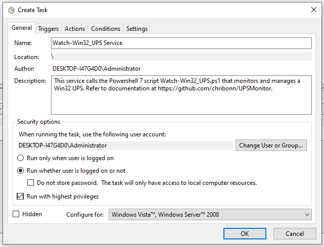
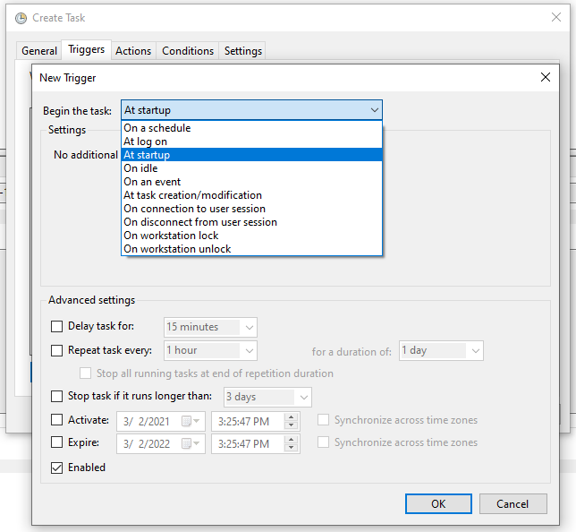
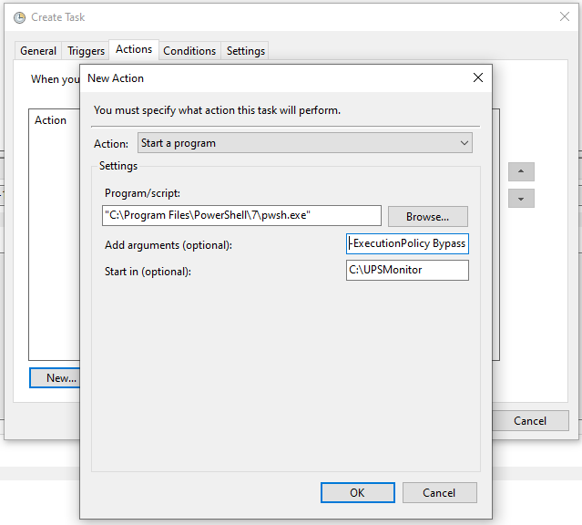
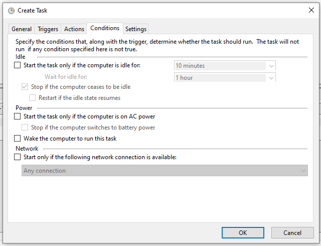
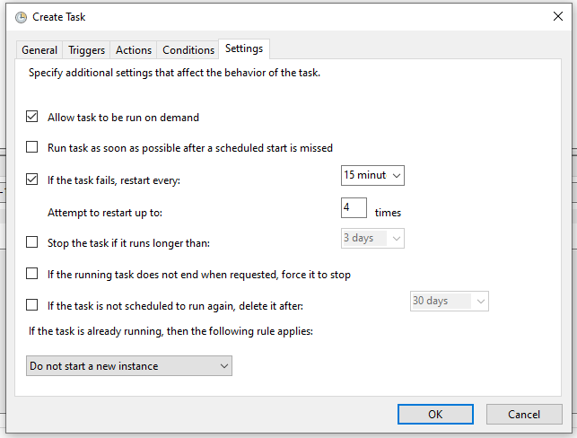
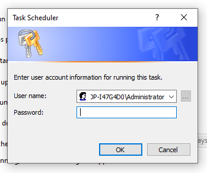

# Watch-Win32_UPS

## What is Watch-Win32_UPS

Watch-Win32_UPS is a utility written and tested in Powershell script (v 7.1) that taps into the Microsoft Windows OS *Win32_Battery* class in order to provide the following  functions:

* Email alerts 
* Logging functions
* Action script 

Watch-Win32_UPS monitors the UPS battery state, the percentage capacity remaining and the estimatd run time remaining (in minutes).  It raised email alerts, logs to the file or invokes the shutdown script based on these settings.

All options are customisable and optional. Watch-Win32_UPS can be setup so that no email alerts are generated, or have logging switched off. The Action script is optional as well. At least one of the three options must be activated for the utility to run (let's save CPU cycles if nothing useful is coming out of this.)

For more information type

    get-help .\Watch-Win32_UPS.ps1

or

    .\Watch-Win32_UPS.ps1 -help

The most uptodate version of this utility can be downloaded from https://github.com/chribonn/UPSMonitor

## Action Script

The purpose of the action script is normally to shutdown the computer. It is invoked when the power supply is off and trigger points (percentage capacity and remaining time) fall below specified values.

The Action script is seperate from Watch-Win32_UPS core script. This has been done in order to allow users the freedom to set it up to their needs without having to mess with the Watch-Win32_UPS core code.  Use cases could be to shut down multiple computers, virtual machines and send alerts (other than built in email).

The bundled action script is called **Invoke-Shutdown.ps1**.

## PowerShell 7

PowerShell 7 or above is required to run this script. This version of PowerShell does not come installed by default on Windows.

Information on how to install this version is available on the  Microsoft page [Installing PowerShell on Windows](https://docs.microsoft.com/en-us/powershell/scripting/install/installing-powershell-core-on-windows?view=powershell-7.1)

## Configure Powershell execution policy if you get a PSSecurityException error

If you get an error when you execute the script similar to the one herunder you need to change the execution policy.

    .\Watch-Win32_UPS.ps1 : File .\Watch-Win32_UPS.ps1 cannot be loaded because running scripts is disabled on this system. For more information, see about_Execution_Policies at https:/go.microsoft.com/fwlink/?LinkID=135170.

    At line:1 char:1
    + .\Watch-Win32_UPS.ps1 -help
    + ~~~~~~~~~~~~~~~~
        + CategoryInfo          : SecurityError: (:) [], PSSecurityException
        + FullyQualifiedErrorId : UnauthorizedAccess
	
Open Powershell as administrator and execute the following

    Set-ExecutionPolicy -ExecutionPolicy RemoteSigned

## How to setup Watch-Win32_UPS to run automatically when the computer boots up

Task Scheduler will be used to program a task that will run on computer startup and invoke Watch-Win32_UPS PowerShell script.

Right click on the **Task Scheduler Library** and select the **Create Task...** option.

### Task Scheduler -> General

Task Name (you can define your own): *Watch-Win32_UPS Service*  

Description (you can use your own / optional): *This service calls the PowerShell 7 script Watch-Win32_UPS.ps1 that monitors and manages a Win32 UPS. Refer to documentation at https://github.com/chribonn/UPSMonitor for more information / use cases.* 

Run whether user is logged on or not: *Checked* 

Run with the highest privileges: *Checked* 

### Task Scheduler -> Triggers

Begin the task: *At startup*

Stop the task if it runs longer than: *Unchecked*

Enabled: *Checked*

### Task Scheduler -> Actions

Action: *Start a program*

Program/script (Location where PowerScript 7 is installed): *"C:\Program Files\PowerShell\7\pwsh.exe"*

Add arguments (optional) *(modify parameters as required): -ExecutionPolicy Bypass Watch-Win32_UPS.ps1 -TriggerShutdownPerc 85 -TriggerShutDownRunTime 30 -EmailTo "alert email" -EmailFromUn "Sender email" -EmailFromPw "Sender email password" -EmailSMTP "SMTP server" -EmailSMTPPort SMTPPort -EmailSMTPUseSSL -PollFrequency 5 -ShutdownScript ".\\Invoke-Shutdown.ps1" -LogDir "C:\\UPSLog" -LogFile "Watch-Win32_UPS.log"*

Optional parameters: 

* Email parameters
* Shutdown Script
* Log file settings

Start in (optional) (Location where Watch-Win32_UPS is installed): *"C:\UPSMonitor"* 

### Task Scheduler -> Conditions

Start the task only if the computer is idle for: *Unchecked* 

Start the task only if the task is on AC power: *Unchecked* 

Wake the computer to run this task: *Unchecked* 

Start only if the following network connection is available: *Unchecked* 

### Task Scheduler -> Settings

Allow task to be run on demand: (Useful if you need to debug) *Checked* 

Run task as soon as possible after a scheduled start is missed: *Unchecked* 

If the task fails, restart every (This ensures that if for some reason the script fails it retries): *15 minutes* 

Attempt to restart up to (This ensures that if for some reason the script fails it retries): *4* times

Stop the task if it runs longer than: *Unchecked* 

If the running task does not end when requested, force it to stop (The solution can be termined gracefully so there should not be a need have this option): *Unchecked* 

### Task Scheduler -> Specify Credentials

After clicking **OK** Task Scheduler will prompt for a password under which this task will execute.

